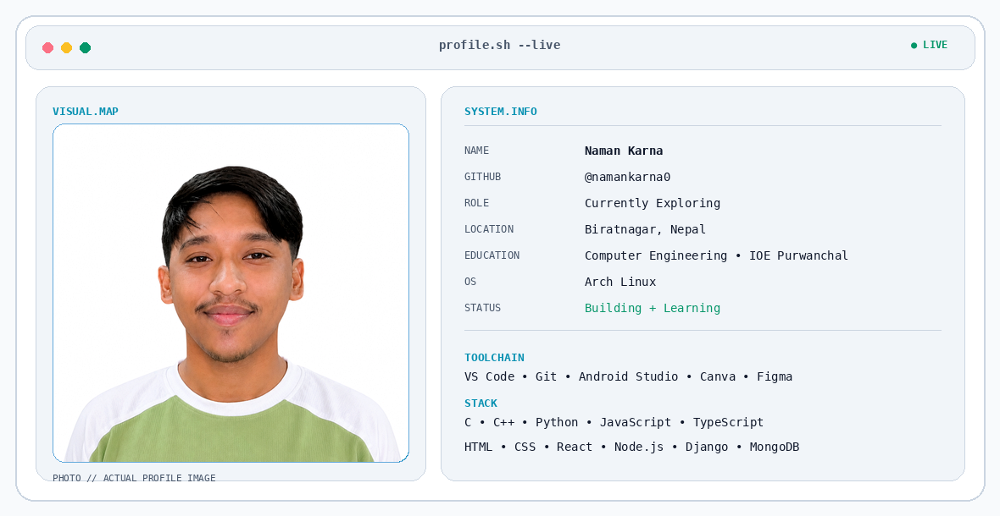

<picture>
  <source media="(prefers-color-scheme: dark)" srcset="./dark.png">
  <source media="(prefers-color-scheme: light)" srcset="./light.png">
  
</picture>
---

## 📊 GitHub Stats

 

---

## 🐍 Contribution Activity

<picture>
  <source
    media="(prefers-color-scheme: dark)"
    srcset="https://raw.githubusercontent.com/namankarna0/namankarna0/output/github-snake-dark.svg">

  <source
    media="(prefers-color-scheme: light)"
    srcset="https://raw.githubusercontent.com/namankarna0/namankarna0/output/github-snake.svg">

  
</picture>

---

## 🔗 Connect With Me

&nbsp;&nbsp;

&nbsp;&nbsp;

&nbsp;&nbsp;

---

  Building + Learning • Currently Exploring

